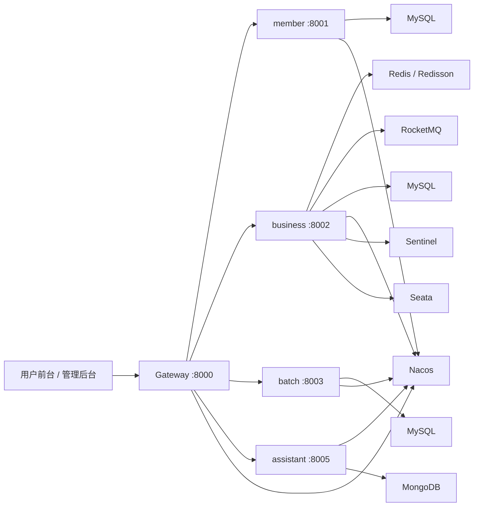

# M12306

<div align="center">
  

  <h2>高并发抢票 · 微服务拆分 · 简易 AI Agent</h2>
  <p>一个适合学习 Java 后端进阶能力的 12306 项目</p>
</div>

> 一个更适合写进简历、拿来拆源码、顺手练高并发设计的 12306 学习项目。

<div align="center">

### 抢票链路不是堆业务，而是把并发、性能和系统设计真正走通

`微服务拆分` `高并发接口设计` `Redis 令牌控制` `RocketMQ 异步削峰` `Redisson 分布式锁` `Sentinel 限流` `Seata 事务一致性` `简易 AI Agent`

</div>

<div align="center">

[](#项目一句话)
[](#为什么值得看)
[](#项目亮点)

[](#技术栈)
[](#架构示意)
[](#快速启动)

[](#推荐阅读顺序)
[](#roadmap)

</div>

---

<a id="项目一句话"></a>
## 项目一句话

这是一个面向学习与实践的 12306 仿站项目，核心目标不是“做一个功能很多的订票系统”，而是把一套**高并发抢票链路**、**微服务模块拆分**、**性能优化思路**，以及**简易 AI Agent 接入方式**尽量做得清晰、可读、可复用。

如果你正在找一个不止于 CRUD 的 Java 项目，这个仓库会比较适合你。

## 适合谁看

- 想系统练手 Spring Boot 3 + Spring Cloud 微服务的同学
- 想找高并发接口设计案例，而不是普通后台管理系统的同学
- 想把 Redis、RocketMQ、Sentinel、Seata 串起来理解的同学
- 想做“传统业务系统 + AI assistant”组合项目的同学
- 想丰富简历项目深度、准备面试项目亮点的同学

## 首屏亮点

### 这不是一个普通的 12306 Demo

- 它把最值得学的部分放在了**抢票核心链路**
- 它不只展示“能下单”，还展示“高峰期怎样尽量稳住系统”
- 它不是单体练手，而是带有完整微服务拆分思路
- 它额外接入了一个简易 AI assistant，让项目更有扩展感

### 你能从这个项目里学到什么

- 如何设计高并发下单入口，减少无效流量直击数据库
- 如何利用 Redis 令牌、MQ 排队、分布式锁控制抢票并发
- 如何在余票扣减、座位分配、订单推进中兼顾性能与正确性
- 如何把网关、注册中心、配置中心、限流、事务协调串成一套系统
- 如何在 Java 项目里加入一个能展示亮点的 AI Agent 模块

### 项目气质

> 学习向，但不玩具。  
> 业务向，但不只是 CRUD。  
> 能运行，也能拿来讲架构、讲并发、讲优化。

> 本项目仅作为学习向项目，不用于任何生产场景。

<a id="为什么值得看"></a>
## 为什么值得看

和普通 CURD 练手项目不太一样，这个仓库更值得看的地方主要在“高并发接口怎么设计”：

- **下单前置拦截**：通过验证码、登录态、秒杀令牌等前置校验，尽量把无效请求挡在核心链路之外
- **Redis 令牌控制**：对抢票资格做缓存化控制，降低数据库直压
- **RocketMQ 异步削峰**：确认订单先入队，再由消费者串行/分批处理，缓解瞬时流量冲击
- **Redisson 分布式锁**：以日期 + 车次维度控制并发处理，避免超卖和重复处理
- **Sentinel 限流熔断**：对热点接口做保护，防止系统在高压下雪崩
- **Seata 分布式事务**：下单成功后的票库存、座位状态、会员车票记录协同提交
- **座位分配策略**：支持相邻座、偏移座位计算、区间占座校验，体现核心业务复杂度

如果你想找的是：

- 一个能看懂高并发抢票接口骨架的 Java 项目
- 一个适合写进简历、二开、做课程设计/毕设演示的项目底座
- 一个把传统后端系统和 AI assistant 结合起来的练手样例

那这个仓库会比较有参考价值。

<a id="项目亮点"></a>
## 项目亮点

### 1. 高并发抢票链路

项目在 `business` 模块里实现了较完整的抢票主链路：

1. 用户从前端发起确认订单请求
2. 网关统一转发与登录态校验
3. 抢票前先校验秒杀令牌 `SkToken`
4. 请求写入确认订单表，状态置为 `INIT`
5. 通过 RocketMQ 投递购票消息，先排队再处理
6. 消费端获取 Redisson 分布式锁，按车次串行化处理
7. 进行余票扣减、座位分配、订单状态推进
8. 通过 Seata 协调事务，保证多表/跨服务数据一致性

这条链路比较适合学习：

- 如何把同步请求改造成异步排队
- 如何降低数据库热点竞争
- 如何控制超卖问题
- 如何把“业务正确性”和“系统吞吐量”一起考虑

### 2. 微服务模块拆分清晰

项目不是单体应用，而是拆成了多个职责相对明确的模块：

```text
M12306
├─ gateway      网关入口，统一路由与鉴权
├─ member       会员、乘客、我的车票
├─ business     车次、车站、余票、确认订单、抢票核心逻辑
├─ batch        定时任务、日常车次数据生成
├─ common       通用响应、工具类、拦截器、异常处理
├─ generator    MyBatis / 代码生成器
├─ web          用户前台（Vue3）
├─ admin        管理后台（Vue3）
└─ AI assistant 简易 AI Agent / 智能客服实验模块
```

这样的结构很适合学习“服务边界怎么划分”，后续也方便继续拓展：

- 接支付
- 接消息通知
- 接监控告警
- 接推荐系统或智能客服

### 3. 简易 AI Agent 加分项

仓库中额外提供了 `AI assistant` 模块，已经不是单纯“对话接口”，而是一个偏 agent 化的学习样例，包含：

- LangChain4j 集成
- OpenAI 兼容接口 / DashScope / Ollama 多模型接入
- MongoDB 对话记忆
- Embedding / RAG 相关实验代码
- Tool Calling 风格的工具类封装
- 面向 12306 场景的智能客服雏形

如果你希望在传统 Java 项目里加一点 AI 能力，这个模块会很有展示效果。

<a id="技术栈"></a>
## 技术栈

### 后端

- Java 17
- Spring Boot 3
- Spring Cloud
- Spring Cloud Alibaba
- Spring Cloud Gateway
- OpenFeign
- MyBatis
- MyBatis-Plus（AI assistant 模块）
- Redis / Redisson
- RocketMQ
- Sentinel
- Seata
- Nacos
- MySQL
- Quartz

### 前端

- Vue 3
- Vue Router
- Vuex
- Ant Design Vue
- Axios

### AI

- LangChain4j
- DashScope Compatible API
- Ollama
- MongoDB
- Pinecone / Easy RAG 相关实验依赖

<a id="架构示意"></a>
## 架构示意



<a id="核心模块说明"></a>
## 核心模块说明

### `gateway`

- 统一服务入口
- 路由转发到 `member` / `business` / `batch` / `assistant`
- 登录 token 校验
- 跨域配置

默认端口：

- `8000`

### `member`

- 会员注册/登录
- 乘车人管理
- 我的车票

默认端口：

- `8001`

### `business`

这是整个项目最值得看的模块，包含：

- 车站、车次、车厢、座位、日常车次
- 余票查询
- 秒杀令牌 `SkToken`
- 确认订单排队
- 座位分配与区间售卖
- MQ 异步消费
- 并发控制与性能优化

默认端口：

- `8002`

### `batch`

- 定时任务
- 每日车次数据准备
- 后台任务调度

默认端口：

- `8003`

### `web`

- C 端用户前台
- 登录、购票、乘客管理、订单查看、AI 助手入口

默认端口：

- `9000`

### `admin`

- B 端管理后台
- 基础数据维护
- 车次、车站、车厢、座位、令牌、订单、任务管理

默认端口：

- `9001`

### `AI assistant`

- 12306 场景智能问答
- 简易 Agent
- 工具调用实验
- 记忆与 RAG 能力尝试

默认端口：

- `8005`

<a id="快速启动"></a>
## 快速启动

### 1. 环境准备

建议本地先准备：

- JDK 17
- Maven 3.9+
- Node.js 18+
- MySQL 8
- Redis
- Nacos
- RocketMQ
- Sentinel Dashboard
- Seata
- MongoDB（用于 AI assistant）
- Ollama 或 DashScope Key（如果你要体验 AI assistant）

### 2. 初始化数据库

执行 `sql` 目录下脚本：

- `sql/member.sql`
- `sql/business.sql`
- `sql/batch.sql`

默认数据库名可以按配置使用：

- `train_member`
- `train_business`
- `train_batch`

### 3. 启动基础依赖

先启动：

- MySQL
- Redis
- Nacos `127.0.0.1:8848`
- RocketMQ NameServer / Broker
- Sentinel Dashboard
- Seata Server
- MongoDB（可选，AI assistant 需要）

### 4. 启动后端服务

根目录是 Maven 聚合工程，核心模块包括：

```bash
mvn clean install
```

然后按顺序启动：

1. `gateway`
2. `member`
3. `business`
4. `batch`
5. `AI assistant`（可选）

也可以分别进入模块后运行 Spring Boot 主类。

### 5. 启动前端

用户前台：

```bash
cd web
npm install
npm run web-dev
```

管理后台：

```bash
cd admin
npm install
npm run admin-dev
```

<a id="推荐阅读顺序"></a>
## 推荐阅读顺序

如果你第一次看这个项目，建议按下面顺序读源码：

1. `gateway` 看统一入口和 token 校验
2. `member` 看用户、乘客、票据基础能力
3. `business/controller/ConfirmOrderController` 看下单入口
4. `business/service/BeforeConfirmOrderService` 看前置校验与 MQ 入队
5. `business/service/SkTokenService` 看秒杀令牌思路
6. `business/mq/ConfirmOrderConsumer` 看异步消费
7. `business/service/ConfirmOrderService` 看核心排队处理与座位分配
8. `business/service/AfterConfirmOrderService` 看事务落库
9. `AI assistant` 看 Java 项目接入 Agent 的方式

<a id="适合谁参考"></a>
## 适合谁参考

- 想做 Java 微服务项目练手的同学
- 想找“高并发业务接口设计”案例的同学
- 想把 Redis / MQ / 分布式锁串起来理解的同学
- 想做一个“传统业务 + AI agent”组合项目的同学
- 想丰富简历项目深度，而不是只停留在普通管理系统的同学

<a id="roadmap"></a>
## Roadmap

这个项目后续还可以继续增强：

- 完善压测脚本与性能报告
- 增加 Docker / Docker Compose 一键启动
- 补充接口文档与系统设计图
- 优化令牌扣减的原子性实现
- 增加监控告警与链路追踪
- 补充更多 AI Agent 工具能力
- 引入自动化测试与 CI

## Star 一下再走

如果这个项目对你有帮助，欢迎点个 `Star` 支持一下。

你收获的不只是一个 12306 Demo，更是一套适合学习的：

- 微服务工程骨架
- 高并发接口设计思路
- 性能优化落地点
- Java + AI Agent 的结合样例

## License

本项目仅供学习与交流使用。
